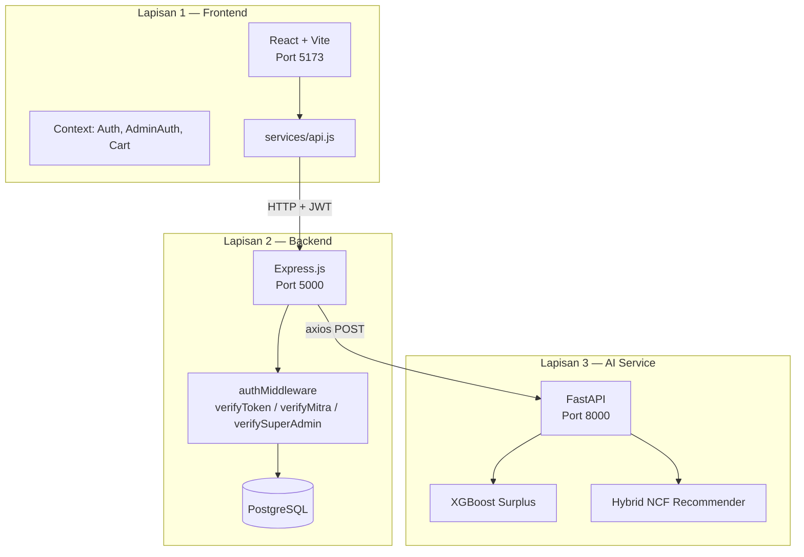
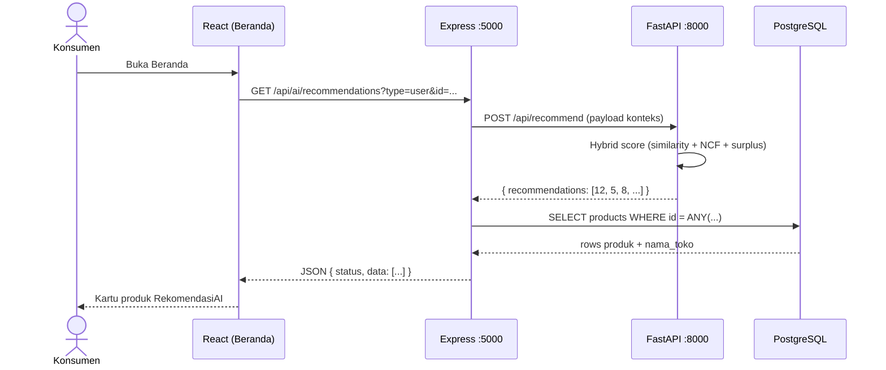
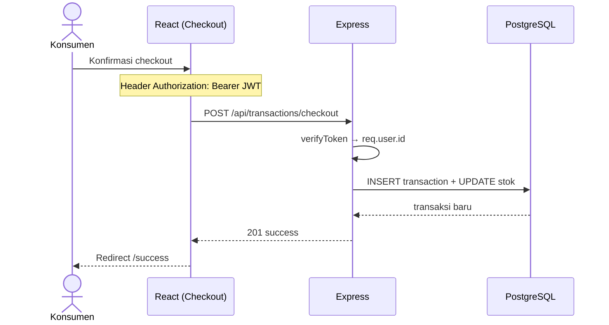
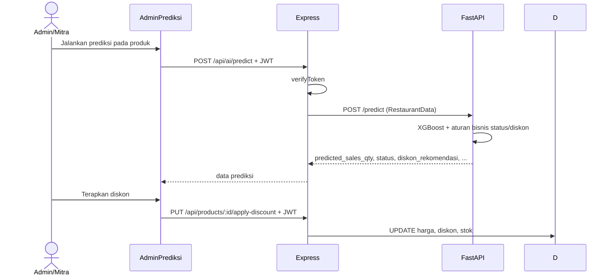
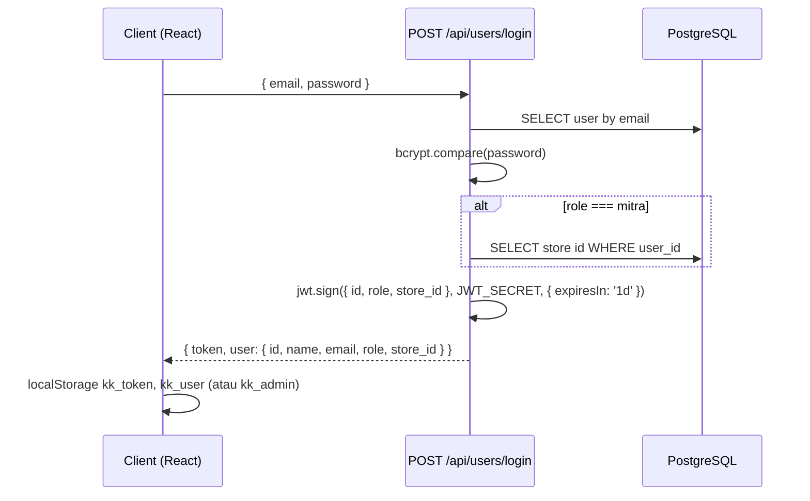
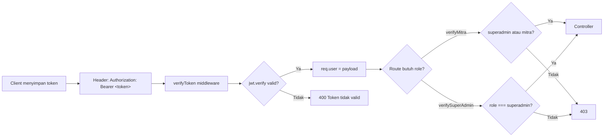
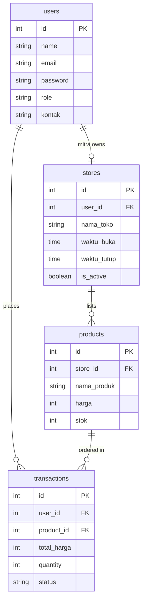

# Arsitektur Sistem — KeduaKali

Dokumen ini menjelaskan arsitektur tiga lapisan, alur data end-to-end, sistem peran pengguna, struktur folder, dan mekanisme autentikasi JWT pada platform **KeduaKali**.

---

## 1. Gambaran Sistem 3 Layer

KeduaKali mengikuti pola **microservice ringan**: frontend berkomunikasi hanya dengan backend Express; backend menjadi *API gateway* untuk database PostgreSQL dan menjembatani permintaan ke layanan AI Python.



### Tanggung jawab per lapisan

| Lapisan | Teknologi | Tanggung jawab |
|---------|-----------|----------------|
| **Frontend** | React, Vite, Tailwind | UI konsumen & admin, state lokal (keranjang), penyimpanan JWT di `localStorage`, routing & guard per role. |
| **Backend** | Express, `pg`, JWT, bcrypt | Autentikasi, otorisasi RBAC, CRUD bisnis, transaksi & stok, proxy ke AI, enrich rekomendasi dari DB. |
| **AI** | FastAPI, XGBoost, TensorFlow | Inferensi prediksi surplus dan ranking rekomendasi; tidak menyimpan sesi user. |

**Prinsip integrasi:** Frontend tidak memanggil FastAPI langsung. Semua fitur AI melalui `/api/ai/*` di Express agar kredensial AI terisolasi di server dan respons rekomendasi bisa digabung dengan data produk/toko dari PostgreSQL.

---

## 2. Alur Data: Dari Klik User hingga Response

### 2.1 Contoh — Rekomendasi di Beranda



Langkah detail:

1. Komponen `RekomendasiAI` memanggil `recommendApi` di `frontend/src/services/api.js`.
2. Express `aiController.getRecommendations` membangun payload (cuaca, meal type, hari, dll.) dan mem-POST ke `AI_SERVICE_URL/api/recommend`.
3. FastAPI mengembalikan array **ID produk** terurut skor.
4. Express men-query PostgreSQL: produk dengan `stok > 0`, diurutkan sesuai ranking AI.
5. React memetakan field DB ke `ProductCard`.

### 2.2 Contoh — Checkout Pesanan



### 2.3 Contoh — Prediksi Surplus (Admin/Mitra)



### 2.4 Ringkasan jalur umum

```
[Klik UI] → [React State / Context] → [fetch + Bearer Token]
    → [Express Route] → [Middleware JWT + Role]
        → [Controller] → [Model / pool.query]
            → [PostgreSQL]
        → (opsional) [axios → FastAPI] → [Model ML]
    → [JSON Response] → [Render UI]
```

---

## 3. Sistem Peran (Role)

Platform menggunakan **Role-Based Access Control (RBAC)** dengan tiga peran utama di tabel `users.role`.

### 3.1 Superadmin

| Aspek | Keterangan |
|-------|------------|
| **Tujuan** | Mengelola seluruh ekosistem platform. |
| **Akses admin** | Semua menu: dashboard, prediksi, toko, produk, pesanan, laporan, mitra, pengguna, pengaturan. |
| **API** | `verifySuperAdmin` — CRUD toko, assign/unassign mitra, daftar/hapus mitra, daftar semua user & transaksi. |
| **Data** | Melihat **semua** toko, produk, dan transaksi tanpa filter `store_id`. |

### 3.2 Mitra

| Aspek | Keterangan |
|-------|------------|
| **Tujuan** | Pemilik/operator toko yang menjual surplus. |
| **Relasi data** | Satu mitra di-assign ke satu toko via `stores.user_id` (setelah superadmin assign). |
| **JWT** | Payload berisi `store_id` agar controller membatasi operasi ke toko sendiri. |
| **Akses admin** | Dashboard, prediksi, edit toko sendiri, produk toko sendiri, pesanan toko sendiri, laporan ESG toko sendiri. **Tidak** bisa: `/admin/mitra`, `/admin/users`. |
| **API** | `verifyMitra` — CRUD produk, ubah status pesanan, prediksi AI, lihat transaksi terfilter `store_id`. |

### 3.3 Konsumen

| Aspek | Keterangan |
|-------|------------|
| **Tujuan** | Membeli produk surplus (self-pickup). |
| **Registrasi** | `POST /api/users/register` → role default `konsumen`. |
| **Akses** | Rute konsumen di `/`; halaman terproteksi: checkout, success, akun, pesanan. |
| **API** | `verifyToken` pada checkout & history; tidak mengakses rute admin. |

### 3.4 Matriks akses (ringkas)

| Fitur | Konsumen | Mitra | Superadmin |
|-------|:--------:|:-----:|:----------:|
| Lihat katalog/toko | ✓ | ✓ | ✓ |
| Checkout | ✓ | — | — |
| Panel `/admin` | — | ✓ | ✓ |
| CRUD semua toko | — | — | ✓ |
| Edit toko sendiri | — | ✓ | ✓ |
| CRUD produk semua toko | — | — | ✓ |
| CRUD produk toko sendiri | — | ✓ | ✓ (semua) |
| Kelola mitra & users | — | — | ✓ |
| Prediksi AI | — | ✓ | ✓ |

### 3.5 Guard di Frontend

```text
ProtectedRoute      → user konsumen + kk_token (AuthContext)
AdminRoute          → role ∈ { superadmin, mitra } + kk_admin
SuperAdminRoute     → role === superadmin saja
```

Admin dan konsumen memakai token yang sama (`kk_token`) tetapi profil admin disimpan terpisah di `kk_admin` setelah login di `/admin/login`.

---

## 4. Struktur Folder Lengkap

```
keduakali_app/
│
├── frontend/                          # Lapisan presentasi (React)
│   ├── index.html
│   ├── vite.config.js
│   ├── tailwind.config.js
│   ├── postcss.config.js
│   ├── package.json
│   └── src/
│       ├── main.jsx                   # Entry React
│       ├── App.jsx                    # Router utama (konsumen + /admin/*)
│       ├── index.css                  # Tailwind base
│       ├── pages/                     # Halaman konsumen
│       │   ├── Beranda.jsx            # Home + rekomendasi + toko
│       │   ├── Katalog.jsx
│       │   ├── DetailProduk.jsx
│       │   ├── DetailToko.jsx
│       │   ├── Keranjang.jsx
│       │   ├── Checkout.jsx
│       │   ├── Success.jsx
│       │   ├── Pesanan.jsx
│       │   ├── Akun.jsx
│       │   ├── Login.jsx
│       │   └── Register.jsx
│       ├── admin/
│       │   ├── components/
│       │   │   ├── AdminLayout.jsx    # Sidebar + RBAC menu
│       │   │   ├── ProductCard.jsx
│       │   │   └── index.jsx          # BottomNav, exports
│       │   └── pages/
│       │       ├── AdminLogin.jsx
│       │       ├── AdminDashboard.jsx
│       │       ├── AdminPrediksi.jsx  # XGBoost simulator
│       │       ├── AdminProduk.jsx
│       │       ├── AdminPesanan.jsx
│       │       ├── AdminToko.jsx
│       │       ├── AdminLaporan.jsx   # ESG impact
│       │       ├── AdminMitra.jsx
│       │       ├── AdminDaftarPengguna.jsx
│       │       └── AdminPengaturan.jsx
│       ├── components/
│       │   ├── RekomendasiAI.jsx      # Widget rekomendasi
│       │   └── SurplusBanner.jsx
│       ├── context/
│       │   ├── AuthContext.jsx        # JWT konsumen
│       │   ├── AdminAuthContext.jsx   # Sesi admin/mitra
│       │   └── CartContext.jsx        # Keranjang + single-store
│       ├── services/
│       │   └── api.js                 # Klien HTTP terpusat
│       ├── utils/
│       │   └── mitraHelper.js
│       └── data/
│           └── products.js            # Helper formatRp, mock lama
│
├── backend/                           # Lapisan aplikasi (Express)
│   ├── index.js                       # Entry (dev + export Vercel)
│   ├── server.js                      # Alternatif server + CORS ketat
│   ├── package.json
│   ├── config/
│   │   └── db.js                      # Pool PostgreSQL + SSL logic
│   ├── middlewares/
│   │   └── authMiddleware.js          # JWT + verifyMitra/SuperAdmin
│   ├── routes/
│   │   ├── userRoutes.js
│   │   ├── productRoutes.js
│   │   ├── transactionRoutes.js
│   │   ├── storeRoutes.js
│   │   └── aiRoutes.js
│   ├── controllers/
│   │   ├── userController.js          # register, login, mitra CRUD
│   │   ├── productController.js
│   │   ├── transactionController.js
│   │   ├── storeController.js
│   │   ├── aiController.js            # Proxy FastAPI
│   │   └── recommendationController.js # Legacy (tidak dipakai di routes)
│   ├── models/
│   │   ├── userModel.js
│   │   ├── productModel.js
│   │   ├── transactionModel.js
│   │   └── storeModel.js
│   └── database/
│       ├── setup.sql                  # Skema awal
│       └── migrate.js                 # Runner migrasi
│
└── keduakali_ai/                      # Lapisan ML (FastAPI)
    ├── app.py                         # API predict + recommend
    ├── requirements.txt
    ├── sync_db_to_ai.py               # PG → hybrid_item_metadata.csv
    ├── artifacts_hybrid_recommender/  # Model NCF + metadata CSV
    │   ├── hybrid_item_metadata.csv
    │   ├── hybrid_evaluation_metrics.json
    │   └── SystemReccomendation.txt
    ├── xgboost_surplus_model.pkl      # (harus disediakan lokal)
    ├── scaler_numeric.pkl
    ├── encoders_dict.pkl
    └── Dokumentasi Integrasi Model Prediksi Surplus - KeduaKalitxt.txt
```

### Penjelasan modul kunci

| Path | Fungsi |
|------|--------|
| `frontend/src/services/api.js` | Satu pintu HTTP ke Express; otomatis menyisipkan `Authorization: Bearer`. |
| `backend/middlewares/authMiddleware.js` | Verifikasi JWT; injeksi `req.user` = `{ id, role, store_id? }`. |
| `backend/controllers/aiController.js` | Jembatan Express ↔ FastAPI + query enrich produk. |
| `keduakali_ai/app.py` | Load model saat startup; endpoint inferensi. |

---

## 5. Alur Autentikasi JWT

### 5.1 Login & penerbitan token



Implementasi: `backend/controllers/userController.js` — `jsonwebtoken` dengan masa berlaku **1 hari**.

**Payload JWT:**

```json
{
  "id": 1,
  "role": "mitra",
  "store_id": 3
}
```

`store_id` hanya diisi untuk mitra yang sudah di-assign ke toko.

### 5.2 Request terautentikasi



Cuplikan middleware:

```javascript
// backend/middlewares/authMiddleware.js
const tokenClean = token.replace('Bearer ', '');
const verified = jwt.verify(tokenClean, process.env.JWT_SECRET);
req.user = verified; // { id, role, store_id? }
```

### 5.3 Penyimpanan di browser

| Key | Isi | Dipakai oleh |
|-----|-----|----------------|
| `kk_token` | String JWT | Konsumen, admin, semua `fetch` terproteksi |
| `kk_user` | JSON profil konsumen | `AuthContext` |
| `kk_admin` | JSON profil admin/mitra | `AdminAuthContext` |
| `kk_cart` | Array item keranjang | `CartContext` |

Setelah refresh halaman, `AuthContext` / `AdminAuthContext` memulihkan sesi dari `localStorage` tanpa memanggil endpoint introspection terpisah.

### 5.4 Otorisasi di controller (defense in depth)

Selain middleware route-level, controller produk/transaksi memeriksa ulang:

- **Mitra:** `store_id` dari JWT harus cocok dengan `products.store_id` / transaksi toko tersebut.
- **Superadmin:** boleh mengoperasikan semua `store_id`.

Contoh: `productController.addProduct` memaksa `finalStoreId = jwtStoreId` jika `role === 'mitra'`.

### 5.5 Logout

- Konsumen: `AuthContext.logout()` menghapus `kk_token` dan `kk_user`.
- Admin: `AdminAuthContext.adminLogout()` menghapus `kk_token` dan `kk_admin`.

### 5.6 Keamanan — catatan operasional

- `JWT_SECRET` harus kuat dan hanya di server backend.
- Jangan commit `.env` (sudah di `.gitignore`).
- Endpoint `GET /api/ai/recommendations` saat ini **publik** (tanpa JWT); pertimbangkan rate limiting di production.
- `POST /api/ai/predict` memerlukan JWT — hanya pengguna terautentikasi yang memicu inferensi surplus berbayar komputasi.

---

## 6. Model Data (relasi utama)



---

## 7. Deployment & skalabilitas (orientasi)

| Komponen | Catatan |
|----------|---------|
| **Backend** | `index.js` mengekspor `app` untuk serverless (Vercel); `listen` hanya jika `NODE_ENV !== 'production'`. |
| **Frontend** | Build statis Vite; set `VITE_API_URL` ke URL API production. |
| **AI** | Layarkan sebagai container/VM terpisah; set `AI_SERVICE_URL` di backend. |
| **DB** | Gunakan `DATABASE_URL` managed (Neon, Supabase, RDS); SSL aktif otomatis jika host bukan `localhost`. |

---

## 8. Referensi cepat port & file entry

| Layanan | Entry | Port default |
|---------|-------|----------------|
| Frontend | `frontend/src/main.jsx` | 5173 |
| Backend | `backend/index.js` | 5000 |
| AI | `keduakali_ai/app.py` | 8000 |

Untuk panduan instalasi langkah demi langkah, lihat **[README.md](./README.md)**.
